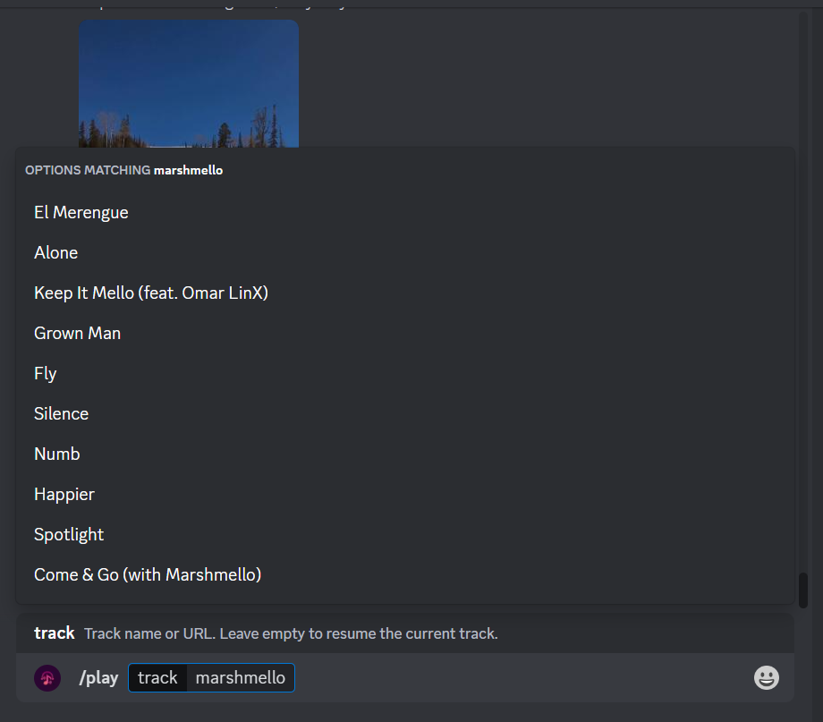

# Discord Music Bot

A Discord bot that provides the ability to search YouTube and play content directly from within Discord. This includes:

-   Full slash-command support
-   The ability to queue up to 25 songs at a time through YouTube radio
-   Convenient input autofill for play, mix, and skip-to commands



## Project structure

Below is a basic overview of the project structure:

```
├── src                  -> main source code
│    ├── interactions    -> functionality for all commands listend in commands.ts
│    ├── utils           -> utility functions
│    ├── app.ts          -> main entrypoint for app
│    └── commands.ts     -> list of commands passed to the Discord API
├── .env.sample          -> sample .env file
├── .gitignore
├── nodemon.json
├── README.md
└── tsconfig.json
```

## Running app locally

Before you start, you'll need to install [NodeJS](https://nodejs.org/en/download/) and [create a Discord app](https://discord.com/developers/applications) with the proper permissions:

-   `applications.commands`
-   `bot` (with Send Messages enabled)

Configuring the app is covered in detail in the [getting started guide](https://discord.com/developers/docs/getting-started).

### Setup project

First clone the project:

```
git clone https://github.com/discord/discord-example-app.git
```

Then navigate to its directory and install dependencies:

```
cd discord-example-app
npm install
```

### Get app credentials

Fetch the credentials from your app's settings and add them to a `.env` file (see `.env.sample` for an example). You'll need your app ID (`APP_ID`), server ID (`GUILD_ID`), bot token (`DISCORD_TOKEN`), and public key (`PUBLIC_KEY`).

Fetching credentials is covered in detail in the [getting started guide](https://discord.com/developers/docs/getting-started).

> 🔑 Environment variables can be added to the `.env` file in Glitch or when developing locally, and in the Secrets tab in Replit (the lock icon on the left).

### Run the app

After your credentials are added, go ahead and run the app:

```
npm start
```

> ⚙️ A package [like `nodemon`](https://github.com/remy/nodemon), which watches for local changes and restarts your app, may be helpful while locally developing.
